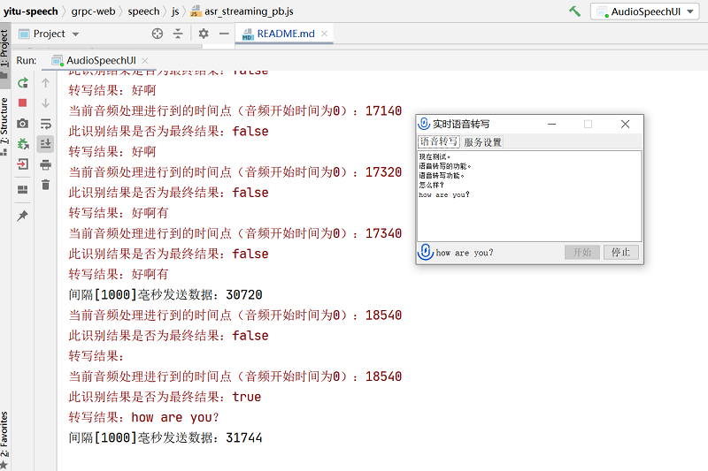

# yitu-speech

#### 介绍
依图实时语音转写
依图实时语音转写通过与转写引擎建立长连接，提供实时的文字输出能力。  
实时语音转写的客户端需使用GRPC接口与Protobuf协议与服务器端进行通信。  

#### 软件架构
Java、Swing、GRPC、protobuf

#### 安装教程

1.  生成Java Model  
> protoc --java_out=./ asr_streaming.proto  
2.  生成Java Service  
> protoc --plugin=protoc-gen-grpc-java=./protoc-gen-grpc-java-1.32.1-windows-x86_32.exe --grpc-java_out=./ asr_streaming.proto
3.  生成Web Js  
> protoc -I=./ ./asr_streaming.proto --js_out=import_style=commonjs:./ --plugin=protoc-gen-grpc=./protoc-gen-grpc-web.exe --grpc-web_out=import_style=commonjs,mode=grpcwebtext:./  

> browserify asr_streaming_pb.js > asr_streaming_pb2.js  

> browserify asr_streaming_grpc_web_pb.js > asr_streaming_grpc_web_pb2.js

#### 使用说明

